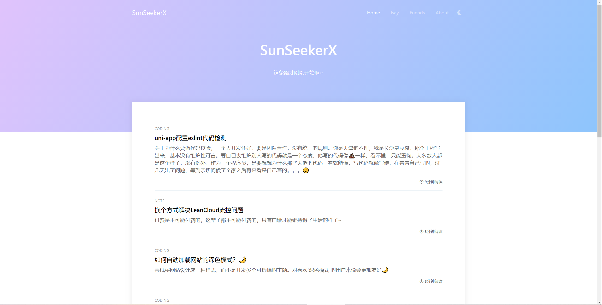

# Ghost Theme Frenemy

> 来源：[Ghost-Theme-Frenemy](https://github.com/JaxsonWang/Ghost-Theme-Frenemy)
>
> 大佬新的主题：[Rebirth](https://github.com/JaxsonWang/Rebirth)
>
> 原主题已经不更新维护，个人很喜欢该主题的阅读感觉。遂fork进行独立维护。

预览：[https://yoouu.cn/](https://yoouu.cn/)




## 使用

需要有`node.js`和`npm`基础知识

### 克隆源码

```bash
git clone https://github.com/SunSeekerX/Ghost-Theme-Frenemy.git
```

### 安装依赖

进入项目的根目录执行

```bash
yarn
# or npm
npm i 
```

###  替换配置信息

本主题有两个配置信息，分别在`${app}/src/config/index`，`${app}/src/config/build`

`${app}/src/config/index`

在运行时的配置，例如初始化评论，百度统计等

```javascript
export default {
  // baiduTongji: {
  //   // 百度统计key
  //   key: 'xxxxxx',
  // },
  baiduTongji: false,
  /**
   * @name valine配置
   * @more https://valine.js.org/configuration.html
   */
  valineOptions: {
    // Valine 的初始化挂载器。可以是一个CSS 选择器，也可以是一个实际的HTML元素。
    el: '#vcomments',
    // leancloud 应用 appid
    appId: 'xxxxxx',
    // leancloud 应用 appkey
    appKey: 'xxxxxx',
    // 评论框占位提示符。
    placeholder: '请您理智发言，共建美好社会！',
    // Gravatar 头像展示方式。
    avatar: 'mm',
    // 当前文章页路径，用于区分不同的文章页，以保证正确读取该文章页下的评论列表。
    path: window.location.pathname,
    // 文章访问量统计
    visitor: true,
    // 代码高亮
    highlight: true,
    // 是否记录评论者IP
    recordIP: true,
  },
}

```


`${app}/src/config/build`

在编译时的配置，打包完成需要替换主题内的模板字符串，例如备案信息等

```javascript
module.exports = {
  /**
   * @name 备案信息
   */
  record: {
    // 网站备案信息
    siteRecord: {
      // 信息
      name: '湘ICP备19015624号',
      // 网站备案查询地址：以下为默认
      url: 'http://beian.miit.gov.cn/',
    },

    // 公安备案信息
    publicRecord: {
      // 信息
      name: '',
      // 地址
      url: '',
    },
  },
}
```


### 关闭配置

例如关闭百度统计配置，设置`baiduTongji`为`false`，即可关闭百度统计。

设置`valineOptions`为`false`，即可关闭评论


### 编译打包

项目根目录下执行

```bash
yarn build
# or npm
npm run build
```


### 上传主题

打包之后的文件位于`${app}/dist/frenemy.zip`，通过`ghost`后台上传即可。


## 开发

到你上传主题的根目录下，删除所有文件，把本项目所有文件替换到主题目录下。即可开始开发。

`${your projecr path}/Ghost/content/themes/Ghost-Theme-Frenemy-master`


使用Gulp/PostCSS编译样式以满足未来的CSS规范。你需要全局安装 [Node](https://nodejs.org/), [Yarn](https://yarnpkg.com/) 和[Gulp](https://gulpjs.com)。 然后进入主题根目录执行:

```bash
# 安装依赖
yarn

# 运行编译和监控文件
$ yarn server
```


### 主题内需要替换的模板字符串

`default.hbs`

$siteRecord.url$ - 备案信息链接地址

$siteRecord.name$ - 备案显示名字


# Copyright & License

Copyright (c) 2013-2020 Ghost Foundation - Released under the [MIT license](LICENSE).